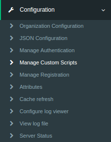

# Custom Script / Interception Script
Gluu Server is very flexible by design enabling the use of [Jython](http://www.jython.org/docs/tutorial/indexprogress.html) interception scripts to customize behaviour. Jython was chosen because an interpreted language facilitates dynamic creation of business logic, and makes it easier to distribute this logic to a cluster of Gluu servers. Another advantage of Jython was that developers can use either Java or Python classes. Combined with the option of calling web services from Python or Java, this enables the Gluu Server to support any business-driven policy requirement.

Custom Scripts can be accessed by navigating to Configuration 
and selecting the `Manage Custom Scritps` tab.



## Interception Script Methods
There are three methods that inherit a base interface

|Inherited Methods|Method description|
|-----------------|------------------|
|def init(self, configurationAttributes) |This method is only called once during the script initialization. It can be used for global script initialization, initiate objects etc|
|def destroy(self, configurationAttributes) |This method is called once to destroy events. It can be used to free resource and objects created in the `init()` method|
|def getApiVersion(self) |The `getApiVersion` method allows API changes in order to do transparent migration from an old script to a new API. Currently all scripts should return `1`|

The `configurationAttributes` parameter is `java.util.Map<String, SimpleCustomProperty>` with properties specified in `oxConfigurationProperty` attributes.

The script manager only loads enabled scripts. Hence, after enabling a
script, the script manager should trigger an event to either load or
destroy a script. All scripts are stored in LDAP in the
`ou=scripts,o=<org_inum>,o=gluu` branch.

This is a sample entry:

```
    dn: inum=@!1111!031C.4A65,ou=scripts,o=@!1111,o=gluu
    objectClass: oxCustomScript
    objectClass: top
    description: <custom_script_description>
    displayName: <display_name>
    gluuStatus: true
    inum: @!1111!031C.4A65
    oxLevel: <priority>
    oxModuleProperty: {"value1":"module_property_name","value2":"module_property_value","description":""}
    oxConfigurationProperty: {"value1":"configuration_property_name","value2":"configuration_property_value","description":""}
    oxRevision: <revision>
    oxScript: <custom_script>
    oxScriptType: <script_type>
    programmingLanguage: python
```

The script manager reloads scripts automatically without needing to
restart the application once `oxRevision` is increased.

## Interception Script Logs
The log files regarding interception scripts are not stored in the
`wrapper.log` file. The logs are separated according to the module they
affect. The oxAuth custom script logs are stored in `oxauth_script.log`
and the oxTrust custom script logs are stored in the
`oxtrust_script.log`. Please refer to these log files for any errors in
the interception scripts or following the workflow of the script.

# Person Authentication
**For a list of pre-written, open source Gluu authentication scripts, view our [server integrations](https://github.com/GluuFederation/oxAuth/tree/master/Server/integrations)**

An authentication script enables you to customize the user
authentication experience. For example, you can write a script that
enables a two-factor authentication mechanism like Duo Security. By
default oxAuth uses simple username/password authentication method. This
script type allows an admin to implement more secure workflows to cover
an organizations security requirements. It extends the base script type
with the `init`, `destroy` and `getApiVersion` methods but also adds the
following methods:

|Method|isValidAuthenticationMethod(self, usageType, configurationAttributes)|
|---|---|
|**Description**|This method is used to check if the authentication method is in a valid state. For example we can check there if a 3rd party mechanism is available to authenticate users. As a result it should either return `True` or `False`|
|Method Parameter|`usageType` is `org.xdi.model.AuthenticationScriptUsageType`<br/>`configurationAttributes` is `java.util.Map<String, SimpleCustomProperty>`|

|Method|def getAlternativeAuthenticationMethod(self, usageType, configurationAttributes)|
|---|---|
|**Description**|This method is called only if the current authentication method is in an invalid state. Hence authenticator calls it only if `isValidAuthenticationMethod` returns False. As a result it should return the reserved authentication method name|
|Method Parameter|`uageType` is `org.xdi.model.AuthenticationScriptUsageType`<br/>`configurationAttributes` is `java.util.Map<String, SimpleCustomProperty>`|

|Method|def authenticate(self, configurationAttributes, requestParameters, step)|
|---|---|
|**Description**|This method is the key method within the person authentication script. It checks if the user has passed the specified step or not. As a result it should either return `True` or `False`|
|Method Parameter|`requestParameters` is `java.util.Map<String, String[]>`<br/>`step` is java integar<br/>`configurationAttributes` is `java.util.Map<String, SimpleCustomProperty>`|

|Method|def prepareForStep(self, configurationAttributes, requestParameters, step)|
|---|---|
|**Description**|This method can be used to prepare variables needed to render the login page and store them in an according event context. As a result it should either return `True` or `False`|
|Method Parameter|`requestParameters` is `java.util.Map<String, String[]>`<br/>`step` is a java integer<br/>`configurationAttributes` is `java.util.Map<String, SimpleCustomProperty>`|

|Method|def getCountAuthenticationSteps(self, configurationAttributes)|
|---|---|
|**Description**|This method should return an integer value with the number of steps in the authentication workflow|
|Method Parameter|`configurationAttributes` is `java.util.Map<String, SimpleCustomProperty>`|

|Method|def getExtraParametersForStep(self, configurationAttributes, step)|
|---|---|
|**Description**|This method provides a way to notify the authenticator that it should store specified event context parameters event in the oxAuth session. It is needed in a few cases, for example when an authentication script redirects the user to a 3rd party authentication system and expects the workflow to resume after that. As a result it should return a java array of strings|
|Method Parameter|`configurationAttributes` is `java.util.Map<String, SimpleCustomProperty>`<br/>`step` is a java integer|

|Method|def getPageForStep(self, configurationAttributes, step)|
|---|---|
|**Description**|This method allows the admin to render a required page for a specified authentication step. It should return a string value with a path to an XHTML page. If the return value is empty or null, the authenticator should render the default log in page `/login.xhtml`|
|Method Parameter|`configurationAttributes` is `java.util.Map<String, SimpleCustomProperty>`<br/>`step` is a java integar|

|Method|def logout(self, configurationAttributes, requestParameters)|
|---|---|
|**Description**|This method is not mandatory. It can be used in cases when you need to execute specific logout logic within the authentication script when oxAuth receives an end session request. Also, it allows oxAuth to stop processing the end session request workflow if it returns `False`. As a result it should either return `True` or `False`|
|Method Parameters|`configurationAttributes` is `java.util.Map<String, SimpleCustomProperty>`<br/>`requestParameters` is `java.util.Map<String, String[]>`|

This script can be used in oxAuth application only.

- [Sample Authentication Script](./sample-authentication-script.py)
