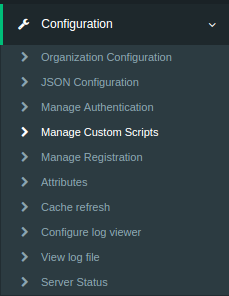
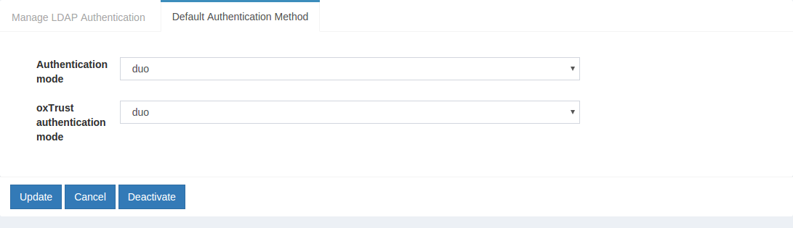
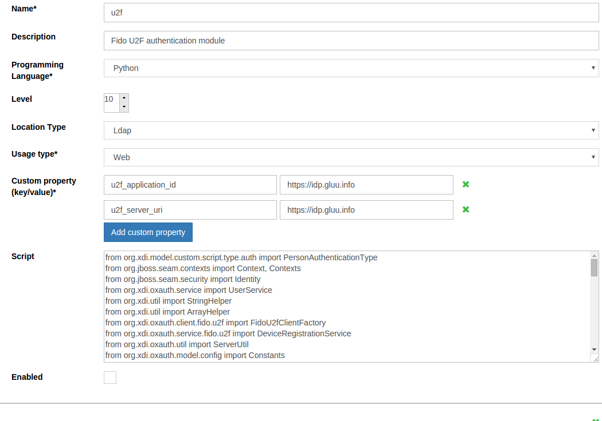
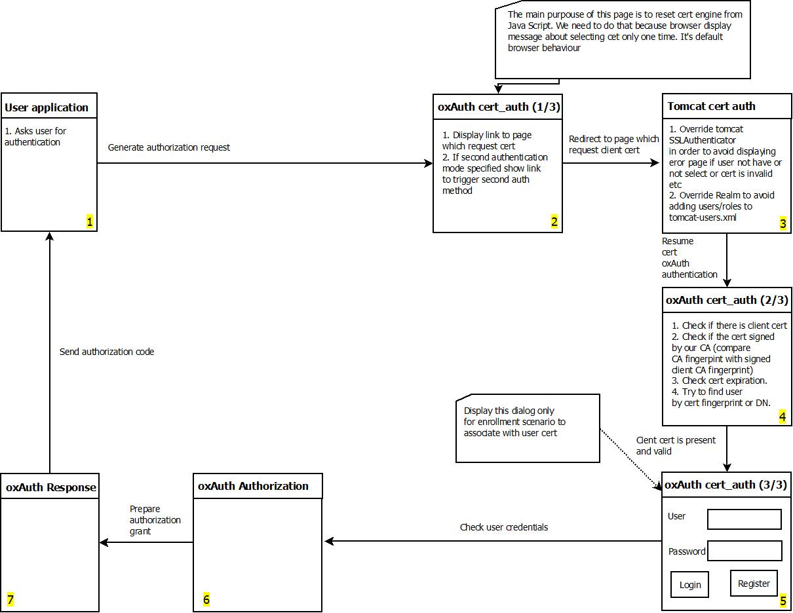
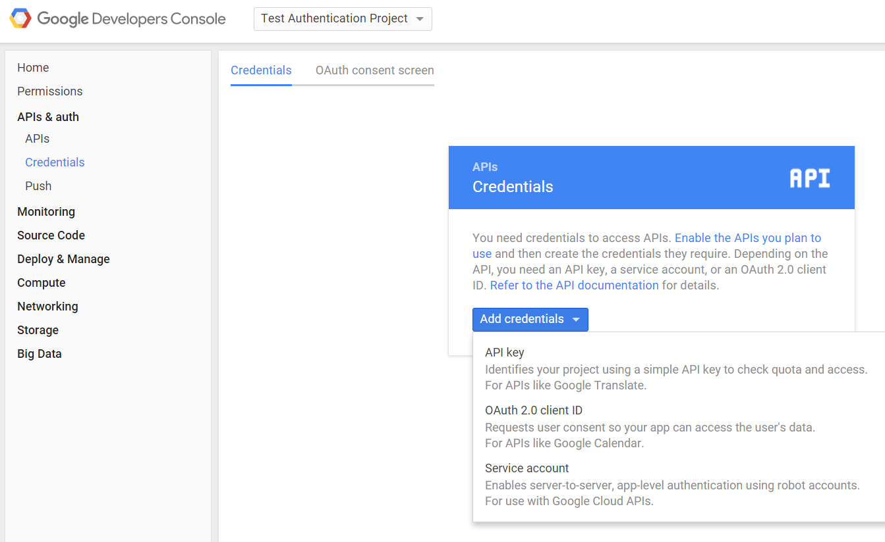
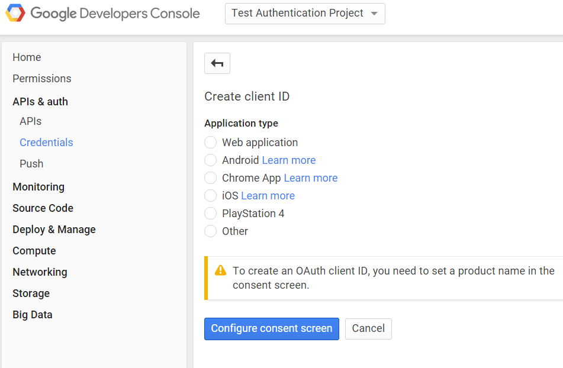
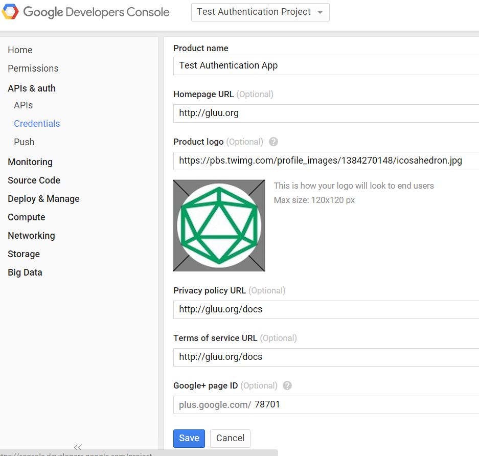

# Multi Factor Authentication
Using the  Gluu Server, you can define the business logic for complex multi-step authentication workflows, providing SSO for people using smart cards, tokens, mobile or biometric authentication mechanisms. You don't have to chose one multi-factor authentication technology. You can have multiple authentication mechanisms active at the same time--Web or mobile clients can request a certain authentication type by using standard OpenID Connect request parameters.

A number of multi-factor authentication scripts are shipped in the Gluu Server by default, including support for FIDO U2F tokens, Gluu's free mobile two-factor application [Super Gluu](https://super.gluu.org), certificate authentication, and Duo Security. 

## DUO Security
### Overview
There are a few properties in the [DUO][duo] Authentication Script.

|	Property	|Status		|	Description	|	Example		|
|-----------------------|---------------|-----------------------|-----------------------|
|duo_creds_file		|Mandatory     |Path to ikey, skey, akey|/etc/certs/duo_creds.json|
|duo_host		|Mandatory    |URL of the DUO API Server|api-random.duosecurity.com|
|audit_attribute	|Optional|Attribute to determine user group|memberOf		|
|duo_group		|Optional|Attribute to enable DUO for specific user|memberOf	|
|audit_group		|Optional|Notify administrator via email upon user login|memberOf|
|audit_group_email	|Optional|Administrator email		| admin@organization.com|

### Configure DUO Account
1. Sign up for a Duo account.

2. Log in to the Duo Admin Panel and navigate to Applications.

3. Click Protect an Application and locate Web SDK in the applications list. Click Protect this Application to get your integration key, secret key, and API hostname.

4. Generate an `akey` value for your instance. [Click here to know more ](https://duo.com/docs/duoweb#1.-generate-an-akey)

For additional info on Duo's Web SDK check [this atricle](https://duo.com/docs/duoweb) 

### Configure CE Chroot
1. Prepare the DUO credential file `/etc/certs/duo_creds.json` with **ikey, akey & skey**

### Configure oxTrust
Follow the steps below to configure the [DUO][duo] module in the oxTrust Admin GUI.

1. Go to Manage Custom Scripts<br/>


2. Scroll down to [DUO][duo] authentication script<br/>


3. Change the value of `duo_host` to your API

4. Enable the script by ticking the check box


5. Change the dufault authenticaiont method to [DUO][duo]


## U2F
This script enables multi-factor authentication with any FIDO U2F device. Learn more about the U2F standard [here](https://www.gluu.org/resources/documents/standards/fido-u2f/). For a list of U2F compliant devices for sale, [check Amazon](http://www.amazon.com/s/ref=nb_sb_noss?url=search-alias%3Daps&field-keywords=U2F). 

Some well known U2F device manufacturers include:  
- [Yubico](https://www.yubico.com/)   
- [HyperFIDO](http://hyperfido.com/)   
- [Feitian Technologies](http://www.ftsafe.com/)    

### Overview
The script has the following properties

|	Property	|	Description		|	Example	|
|-----------------------|-------------------------------|---------------|
|u2f_server_uri		|URL of the u2f server		|https://idp.gluu.info|
|u2f_server_metadata_uri|URL of the u2f server metadata|https://idp.gluu.info|

### Installation
#### Configure oxTrust
Follow the steps below to configure the [DUO][duo] module in the oxTrust Admin GUI.

1. Go to Manage Custom Scripts


2. Click on the Person Authentication tab


3. Select the U2F script


4. Enable the script by ticking the check box


5. Click `Update`

6. Change the `Default Authentication Method` to `u2f`


## oxPush2
#### Overview
The script has the following properties

|	Property	|	Description		|	Example	|
|-----------------------|-------------------------------|---------------|
|application_id		|URL of the identity server	|https://idp.gluu.info|
|authentication_mode	|Determine factor of authentication|two_step|
|credentials_file	|JSON file for oxPush2 		|/etc/certs/oxpush2_creds.json|

### Configure oxTrust

1. Go to Manage Custom Script


2. Click on the Perosn Authentication tab


3. Select the oxPush2 Script


4. Enable the script by ticking the check box


5. Click `Update`

6. Change the Authentication method to oxPush2


## Wikid Authentication
### Overview
The module has the following mandatory properties

|	Peoperty	|	Description			|	Example		|
|-----------------------|---------------------------------------|-----------------------|
|wikid_server_host	|IP address of WIKID server		|192.168.1.1		|
|wikid_server_port	|TCP port for WIKID serve		|[8388][default 8388]	|
|wikid_cert_path	|Path to the PKCS12 certificate file	|/etc/certs/wikid.p12	|
|wikid_cert_pass	|Passphrase for  PKCS12 file		|passphrase		|
|wikid_ca_store_path	|[CA][ca] for WAS server certificate	|/etc/certs/CACertStore.dat|
|wikid_ca_store_pass	|Passphrase to secure the CA store file	|passphrase		|
|wikid_server_code	|Server domain 12 digit code		|135711131719		|

### Installation
### Configure CE Chroot
The following libraries must be present in the `$TOMCAT_HOME/endorsed` folder.

- https://www.wikidsystems.com/webdemo/wClient-3.5.0.jar
- http://central.maven.org/maven2/org/jdom/jdom/1.1.3/jdom-1.1.3.jar
- http://central.maven.org/maven2/log4j/log4j/1.2.17/log4j-1.2.17.jar
- http://central.maven.org/maven2/com/thoughtworks/xstream/xstream/1.4.8/xstream-1.4.8.jar

For more informatiaon about the wClient Library, please see [this page](https://www.wikidsystems.com/downloads/network-clients)

### Token Client
Wikid Authentication requires [token client](https://www.wikidsystems.com/downloads/token-clients). Please install and configure it for 
first time use. The [demo](https://www.wikidsystems.com/demo) explains how to do that.

### Configure oxTrust
1. Go to `Manage Custom Scripts`


2. Click on the `Add custom script configuration` button


3. Fill up the form and add the [Wikid Authentication Script](https://raw.githubusercontent.com/GluuFederation/oxAuth/master/Server/integrations/wikid/WikidExternalAuthenticator.py)

4. Enable the script by ticking the check box


5. Change the `Default Authentication Method` to `wikid`


## Certificate Authentication
The image below contains the design diagram for this module.



The script has a few properties:

|       Property        |Description|   Allowed Values                  |example|
|-------|--------------|------------|-----------------|
|chain_cert_file_path   |mandatory property pointing to certificate chains in [pem][pem] format |file path| /etc/certs/chain_cert.pem   |
|map_user_cert          |specifies if the script should map new user to local account           |true/false| true|
|use_generic_validator  |enable/disable specific certificate validation                         |true/false| false|
|use_path_validator     |enable/disable specific certificate validation                         |true/false| true|
|use_oscp_validator|enable/disable specific certificate validation                              |true/false| false|
|use_crl_validator|enable/disable specific certificate validation                               |true/false| false|
|crl_max_response_size  |specifies the maximum allowed size of [CRL][crl] response              | Integer > 0| 2|

### Configure oxTrust
Follow the steps below to configure the certificate authentication in the oxTrust Admin GUI.

1. Go to Manage Custom Scripts


2. Click on the `Add Custom Scritp` button
[add-script-button](../img/admin-guide/multi-factor/add-script-button.png)

3. Fill up the from and add the [Certificate Authentication Script](https://raw.githubusercontent.com/GluuFederation/oxAuth/master/Server/integrations/cert/UserCertExternalAuthenticator.py)

4. Enable the script by ticking the check box
[enable](../img/admin-guide/enable.png)

5. Change the `Default Authentication Method` to `Cert`


## Configure Google

In order to call Google API's, you need to register as a developer and
create client credentials. Here are some
[instructions](https://developers.google.com/identity/protocols/OAuth2)
for these steps.

The first thing you'll need to do is Create a Project on Google to obtain
client credentials. Click "Create project" and enter your desired
project name.


Then click on your newly created project from the listing on the
dashboard, and under the Credentials section, create a new "OAuth2 2.0
client ID". 



Google will ask you to configure your consent screen, to add your logo
and other information displayed to the user to authorize Google to
release information.



Fill out the form...



Now you're ready to create the credentials. Enter "Authorized JavaScript
origins". It should be the uri of your Gluu Server--for example
`https://idp.example.com`.


Google will display the client-id and the according secret ... ignore
it. Instead, download the JSON file which you are going to upload into
your Gluu Server, next.


Move this file to the location `/opt/tomcat/conf/google.json`. The JSON
file will look something like this example (no... these data are not
valid credentials!):

```
{
  "web": {
    "client_id": "7a64e55f-724d4e8c91823d5f1f18a0b2.apps.googleusercontent.com",
    "auth_uri": "https:\/\/accounts.google.com\/o\/oauth2\/auth",
    "token_uri": "https:\/\/accounts.google.com\/o\/oauth2\/token",
    "auth_provider_x509_cert_url": "https:\/\/www.googleapis.com\/oauth2\/v1\/certs",
    "client_secret": "bb76a2c99be94e35b874",
    "javascript_origins": [
    "https:\/\/brookie.gluu.info"
    ]
  }
}
```

The last step is to enable Google+ API's:

- Navigate back to the Google API [console](https://console.developers.google.com/project)
- Select project and enter project name
- Open new project "API & auth -> API" menu item in configuration navigation tree
- Click "Google+ API"
- Click "Enable API" button

### Configure oxTrust
Follow the steps below to configure the certificate authentication in the oxTrust Admin GUI.

1. Go to Manage Custom Scripts


2. Click on the `Add Custom Scritp` button
[add-script-button](../img/admin-guide/multi-factor/add-script-button.png)

3. Fill up the form and add the [Google External Authenticator](https://raw.githubusercontent.com/GluuFederation/oxAuth/master/Server/integrations/gplus/GooglePlusExternalAuthenticator.py) Script.

You'll also need to add some custom properties:

 * __gplus_client_secrets_file__: `/opt/tomcat/conf/google.json`
 * __gplus_deployment_type__: enroll
 * __gplus_remote_attributes_list__: email, given_name, family_name, and locale
 * __gplus_local_attributes_list__: uid, mail, givenName, sn, cn, preferredLanguage

1. __gplus_client_secrets_file__ - It is a mandatory property that holds
   the path to the application configuration file downloaded from Google
   console for application. An example is `/etc/certs/gplus_client_secrets.json`.
   These are the single steps needed to get it:
    a) Log into: `https://console.developers.google.com/project`
    b) Click "Create project" and enter project name
    c) Open new project "API & auth -> Credentials" menu item in configuration navigation tree
    d) Click "Add credential" with type "OAuth 2.0 client ID"
    e) Select "Web application" application type
    f) Enter "Authorized JavaScript origins". It should be CE server DNS
       name, for example `https://gluu.info`.
    g) Click "Create" and Click "OK" in next dialog
    h) Click "Download JSON" in order to download
       `gplus_client_secrets.json` file.
    Also it is mandatory to enable Google+ API:
    a) Log into `https://console.developers.google.com/project`
    b) Select project and enter project name
    c) Open new project "API & auth -> API" menu item in configuration navigation tree
    d) Click "Google+ API"
    e) Click "Enable API" button

2. __gplus_deployment_type__ - Specify the deployment mode. It is an
optional property. If this property isn't specified the script tries to
find the user in the local LDAP by 'subject_identifier' claim specified
in id_token. If this property has a 'map' value the script allows to map
'subject_identifier' to the local user account. If this property has an
'enroll' value the script adds a new user to the local LDAP with status
'active'. In order to map the IDP attributes to the local attributes it
uses properties from both gplus_remote_attributes_list and
gplus_local_attributes_list. The allowed values are map and enroll.

3. __gplus_remote_attributes_list__ - Comma-separated list of attribute
names (user claims) that Google+ returns which map to local attributes
in the `gplus_local_attributes_list` property. It is mandatory only if
`gplus_deployment_type` is set to 'enroll'.

4. __gplus_local_attributes_list__ - Comma-separated list of Gluu Server
LDAP attribute names that are mapped to Google user claims from the
`gplus_remote_attributes_list` property. It is mandatory only if
`gplus_deployment_type` is set to 'enroll'.

5. __extension_module__ - Optional property to specify the full path of
an external module that implements two methods:

```python
    # This is called when the authentication script initializes
    def init(conf_attr):
        # Code here
        return True/False

    # This is called after authentication
    def postLogin(conf_attr, user):
        # Code here
        return True    # or return False
```

6. __gplus_client_configuration_attribute__ - Optional property to
specify the client entry attribute name which can override
`gplus_client_secrets_file file` content. It can be used in cases when
all clients should use a separate `gplus_client_secrets.json`
configuration.


### Testing

One simple way to test the configuration is to use oxTrust. In the
"Configure Authentication" dropdown menu, select "Google" (or whatever
you entered as the "Name" of the custom authentication script--as the
default authentication method.


After you login and logout, you should be presented with a new login
form that has the Google login button:


After clicking the Google login button, you are presented for
authorization--Google needs to make sure its ok to release attributes to
the Gluu Server:


If the script doesn't work, and you locked yourself out of oxTrust,
don't worry! You can create an LDIF file, for example `revert.ldif`, to
set back the default authentication method, like this:

```
dn: inum=@!1E3B.F133.14FA.5062!0002!4B66.CF9C,ou=appliances,o=gluu
changetype: modify
replace: oxAuthenticationMode
oxAuthenticationMode: internal
```

oxAuthenticationMode corresponds to the 'Name' of the customer
authentication script in oxTrust. Use `internal` to revert to the
default LDAP authentication. You'll have to change the `inum` with the
`inum` of your installation. You can find it using ldapsearch like this:

```
/opt/opendj/bin/ldapsearch -h localhost -p 1389 -D "cn=directory manager" -j ~/.pw -b "ou=appliances,o=gluu" -s one "objectclass=*" inum
```

`~/.pw` is a file with your Directory Manager password. If you don't
remember it, try to find it using `grep`: 

```
grep ldapPass= /install/community-edition-setup/setup.properties.last
```

Once your LDIF looks ok, then use `ldapmodify` to revert back to
password authentication:

```
/opt/opendj/bin/ldapmodify -h localhost -p 1389 -D "cn=directory manager" -j ~/.pw -f revert.ldif
```

If things go wrong, it can leave the sessions in your browser in a bad
state. If things get really weird, remove the cookies in your browser
for the hostname of your Gluu Server.

## Twilio multi-factor Authentication - OTP using custom script

### Writing a Custom Authentication Script

In this document we walk through the steps of writing a script to implement OTP authentication using [Twilio](http://twilio.com) to send an SMS code for a two-step out-of-band authentication mechanism.

At the end of this tutorial you should have a better understanding of how to write your own custom scripts. For reference, you can review the completed Twilio custom authentication script [here](./twilio2FA.py). 

Fields in Custom Script:

|Field     |Description           |
|----------|:---------------------|
|Name    |Name of the Script|
|Description  |[optional] Description about the script|
|Programming Language |Currently Python is supported, In future jscript and Java script might be added|
|Level    | Authentication Level for the authentication, which determines the security level|
|Location Type    |Determines the script location. Can be stored in a "File" or could be stored in "LDAP"|
|Usage Type       |Determines the type of the usage. Web, Native or Both|
|Custome Property |Determines the key and value of the custom property, which can added to the authentication to pass the values|
|Script Box |Script Box will displayed if Location Type is selected as "File", to enter the path of the script|
|Script     |Script Box will be displayed when Location Type is selected as "LDAP"|

### Custom Script Location

Custom scripts can either be inserted directly into the Gluu Server interface or you can specify a path to the script. Specifying a path will make script development easier. There is also an option to revert back to a working script if the script is faulty or needs further enhancements. The administrator can select `File` from the Script Location Type in oxTrust and the file input box will be displayed:


The 'LDAP' option in the Script Location Type can be used to store the script in the LDAP tree once the development is complete. Remember that selecting the `LDAP` method requires the script to be copied in the input box that appears upon LDAP selection:


### Suggested Development Environment

Gluu Server custom scripts are written in [Jython](http://www.jython.org/). It is recommended to use Eclipse for coding purposes.

Now, create some files:
- A Python file for your script
- One or more XHTML files if you have a custom form for your authentication
- One or more XML files (you'll need one for each XHTML file) that provide some information to the Tomcat server about how to display the XHTML file.

### Samples and Documentation

There are many good examples of authentication interception scripts checked into Gluu's  
[oxAuth integrations folder](https://github.com/GluuFederation/oxAuth/tree/master/Server/integrations). Also, the respective `XHTML` and `XML` files are checked in to the [auth folder](https://github.com/GluuFederation/oxAuth/tree/master/Server/src/main/webapp/auth).
The interfaces for the authentication interception can be found in the [Gluu Documentation](http://www.gluu.org/docs/reference/interception-scripts/#authentication).

We used the [Basic Script](https://raw.githubusercontent.com/GluuFederation/oxAuth/master/Server/integrations/basic/BasicExternalAuthenticator.py) 
as a template. The [Wikid forms](https://github.com/GluuFederation/oxAuth/tree/master/Server/src/main/webapp/auth/wikid) were also used as a template since it is required to pass the value of the "code" obtained from Twilio to step 2 of the authentication in order to validate and authenticate the user.

The [Wikid authentication](https://github.com/GluuFederation/oxAuth/blob/master/Server/integrations/wikid/WikidExternalAuthenticator.py) script was also looked upon quite a bit for examples on how to process the form.

### Implement methods

Simple example of how to add a custom template and how to pass values between 2 steps of authentication and save the value temporarily for authentication of a user. Our Sample 
[Twilio script](./twilio2FA.py)

1. Login to Gluu UI
2. Navigate to "Configuration" on the Menu panel to the left
3. Select Manage Custom Scripts
4. Scroll to the end of the page and click on "Add custom script configuration"
5. Enter the Name, Description, Programming Language (Python will be by default, may be in future Java or JavaSCript will be added)
6. Select the Level needed to set the security level to.
7. Select Location Type from the script to be executed.
8. Select the Usage Type required for the authentication.
9. Define Custom property which is provided by Twilio and can be noted down from Twilio account page of the signed up user. 
10. Click on Enabled to enable the added custom script.
11. Scroll down to the end of the update and click on Update button to submit the form. 
12. After the custom script is added, click on Manage Authenticaion on the Menu Panel to left. 
13. Select "Default Authentication Method" tab and change the oxTrust authentication mode to "Twilio" or "Name of the script" from the drop down.

**Note: All three below custom properties are mandatory for the Twilio Two-Factor Authentication script to work**

  - ACCOUNT_SID - Numerical sequence of numbers, to identify the token assigned to the user associated with Twilio.
  - AUTH TOKEN  - Alphanumerical number provided by Twilio for the account holder to identify the user.
  - FROM_NUMBER - Number which is either assigned by Twilio or can be a number user provides to send the code from.

As shown in the below illustration:


### Methods 

**authenticate():**

The most important method to implement is obviously the `authenticate` method. This is where the main business logic is located for
the authentication workflow. It is possible to switch on the step, with the `if (step == 1):` statement. In oxAuth, there is no
assumption that step 1 and step 2 happen on the same server, therefore the value stored in the LDAP using a temporarily created attribute and retrieved in step 2. There the step is sent into the `authenticate` method, which helps to save and retrieve the values whereever required.

Below are few Methods and Libraries used to Save the Value to LDAP and retrieve the values as per the requirement.

**random.randit()** 
random.randit("start number",""end number"), Generates the code as per designer or requirements. 
Example: random.randit(10000,99999)

**context.set()**
This particular method is obtained from jboss to pass the session attribute value to ldap, by creating a temporary attribute which has limited life time and can be retrieved within the life span, expires and session becomes invalid. Save the value of the code obtained through the code generator method. context.set("Name of the temp attribute", `<key>`). Where `<key>` is the value that needs to be stored temporarily in ldap.
Example:
context.set("code",code)

**UserService.instance()** 
Gets the user login instance

**ServerUtil.getFirstValue():**

To access  information from requestParameters in your script with `ServerUtil.getFirstValue(requestParameters, <key>)` where `<key>`
specifies the value you want to retrieve, you can also use another method `requestParameters.get("<key>")`
where `<key>` specifies the value you want to retrieve .

**userService.getUserByAttribute():**

`getUserByAttribute("LDAP Attribute", <key>)` method access the information in LDAP and retrieves the value of the attribute comparing the value of the `<Key>`.
Example:
userService.getUserByAttribute("uid", user_name)

**getAttribute():**
To retrieve the value of an attribute from LDAP, getAttribute("LDAP Attribute name") can be used. 
Example:
getAttribute("mobile")

**requestParameters.get():**
To retrieve values passed from the form through header can be obtained by using the method requestParameters.get(`<key>`). This will retrieve the values from the form via header and can be stored in a string. Where `<key>` is the value to be retrieved from header.
Example:
abc = requestParameters.get("passcode")[0].strip()


**getCountAuthenticationSteps():**

Another method usually needed to implement is `getCountAuthenticationSteps`. This method normally just returns 1, 2, or 3. If implementing an adaptive authentication strategy,
where the number of steps depends on the context. Check out the
Duo script for a good example of this. In our sample 
[Duo script](./DuoExternalAuthenticator.py),

Duo Script was scripted only for those who wanted to use Duo
for the IT group. So this was checked for group membership, and dynamically adjusted the number of steps. And this can be scripted for any logic or attribute to the check the authentication, like "country" or "region".

**getExtraParametersForStep():**

If required to save session variables between steps, use the `getExtraParametersForStep` method. The Gluu Server persists
these variables in LDAP in able to support stateless clustered two
step authentications.

**getPageForStep():**

If required to display a special Web page for an interactive
login, (or even a custom first page) you'll need to implement the
`getPageForStep` which specifies the page you want to return for a given
step.

**session_attributes.get():**
The attribute value that are saved by the session using context.set. This method is derived from the oxauth core java libraries and called using the SessionState parameters which is defined in the code or programme.
session_attributes.get(`<key>`), where `<key>` is the session atribute value that is stored in the ldap.
Example:
session_attributes.get("code")


###Saving the value in LDAP and Passing values between two steps
 
####Saving Values:

**context.set** can be used to save values of the required key to an attribute temporarily and the created temporary attribute will be alive only for limited time and expires and gets removed, by that way, adding new attribute to the user is not messed up. And also the expired attribute kills the validity of the session and becomes invalid.

####Retriving and passing values between the authentication steps:

Using **session_attribute.get()** method, stored session attribute could be retrieved anywhere between the authentication method, by that way the values can be passed between two authentication methods for verification and validation.
Generated code and the entered "code" in the form can be verified using a simple if and the "code" from the form can be obtained using the requestParameters.get() method or serviceUtil.getFirstValue() method.

### Custom Properties

Sometimes it is helpful to enable system administrators to
enter properties that might change a lot. If administrators are
not allowed to modify the script, Custom Property feature can be used, as illustrated in below screenshot:


configurationAttributes.get("<key>").getValue2"():

To access this information in your script with 
`configurationAttributes.get("<key>").getValue2()`
where `<key>` specifies the value you want to retrieve.

### Returning a message to the user

It is possible to use the Context to return a message to the
user, which could be especially useful if an error occurs, or if
required to have some kind of user action.

### Adding Libraries

Pure Python libraries, can be added to `/opt/tomcat/conf/python`, jar files can be added to `/var/gluu/webapps/oxauth/libs`.

**Note:** jar files should be added within chroot. And not in the main `/var/` of the system.

### Testing

When the scripting is done, you can test the script by print
the statments to wrapper.log under `/opt/tomcat/logs/wrapper.log`. 

And by prefix the logs, will help to find the script at ease
using tail command `tail -f | grep <prefix>`, the prefix logs will
provide the script output while one trys to login using the script.

In the Twilio test script, a specific method called
`printOut` has been scripted to make it easier to add this prefix.

Also, remember that putting all the code in a `try / catch`
is a good practice to avoid unhandled exceptions. Since during
debugging, those exception may provide a hint pointing what causes the issue.

Further logs to debug and monitor the sequence can be done using oxauth_script.log and oxauth.log
under`/opt/tomcat/logs/` which is within the chroot.

### Reverting Authentication Method

It is not unlikely that one may get locked out of Gluu
Server, while testing the authentication script.

If there is any problem in it. In such a case the following
method can be used to revert back the older authentication method. 

As a secondary option, InPrivate or Incognito or Private Browser from various Browsers can be used.

Please see the [FAQ](./faq.md) for details.