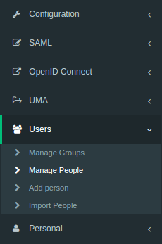
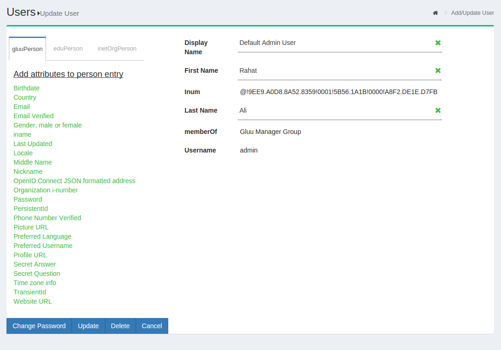
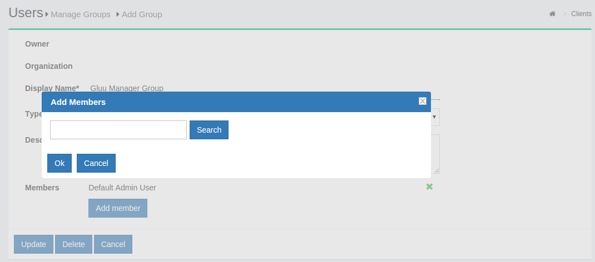
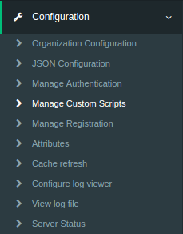

# User Management in Gluu Server
To keep the Gluu Server up-to-date with the latest user claims, your
organization can either "push" or "pull" identity data. In the "pull"
mode, otherwise known as LDAP Synchronization or Cache Refresh, the Gluu
Server can use an existing LDAP identity source like Microsoft Active
Directory as the authoritative source of identity information. If you
"push" identities to the Gluu Server, you can use the JSON/REST SCIM
API. Local user management can also be performed inside oxTrust. Each
method is detailed below.

## Local User Management

In oxTrust, you can add, edit and manage people, groups and user
attributes and claims to ensure the proper information is released about
the right people.

### People
To manage people, navigate to User > Manage People, as shown in the
screenshot below.



From this interface you can add users and search for specific users.
Because the user database can potentially be very large, a value is
required in the search field. In other words, you can not click search
with a blank entry to populate all users. If you need to see all users,
this would be best performed manually within the Gluu OpenDJ server.
Upon performing a user search, a list will be populated with all users
that match the search, as shown in the screenshot below.


To edit a user, simply click on any of the hyperlinks associated with
that user and you will be taken to a user management interface where you
can modify that specific attributes relating to that user as displayed
below.



## Groups
Out of the box, the Gluu Server includes one group: Gluu Server manager
group, named: “gluuManager”. Groups can be added and populated as
needed. By using the *Manage Groups* feature, the Gluu Server
Administrator can add, delete or modify any group or user within a
group. The list of available groups can be viewed by hitting the
_Search_ button with a blank search box.


The Gluu Server Administrator can modify information such as Display
Name, Group Owner, Visibility type etc. The Server Administrator can
also add or delete users within existing groups. The group information
is represented as shown below.


If any member of the Organization is required to be added in any
specific group, this can be achieved be clicking on the Add Member
button. The flow is _Add Member --> Search the name/email of the user
--> Select the user --> Click OK --> Update._


## Cache Refresh
Cache Refresh is the process of connecting an existing backend LDAP server, like Microsoft Active Directory, with the Gluu Server's local LDAP server. Synching people and attributes from a backend server into the Gluu Server speeds up authentication transactions. It is possible to perform attribute transformations, changing the name of attributes, or even using an interception script to change the values. Transformations are stored in the Gluu LDAP service. 


* _Last Run:_ The date and time of the latest cache refresh cycle
  completion is shown here.

* _Updates at the Last Run:_ This shows the total number of users who
  have been updated in the last Cache Refresh cycle. For example an user
  who has any of his attribute updated will show up here.

* _Problem at the Last Run:_ This shows the number of users who have
  been rejected by the Gluu Server during the update. If there are any
  rejections, please contact Gluu Support for clarification and help.


### Customer Backend Key and Attributes


* _Key Attribute:_ This is the unique key attribute of backend Active
  Directory/LDAP Server such as SAMAccountname for any Active Directory.

* _Object Class:_ This contains the Object Classes of the backend Active
  Directory/LDAP which has permission to talk to Gluu Server Cache Refresh
  such as person, organizationalPerson, user etc.

* _Source Attribute:_ This contains the list of attributes which will be
  pulled and read by the Gluu Server.

* _Custom LDAP Filter:_ If there is any custom search required, this
filtering mechanism can be used such as "sn=*" whereas the value of this
field ensures that every user must contain an attribute named SN.

### Source Backend LDAP Servers


This section allows the Gluu Server to connect to the backend Active
Directory/LDAP server of the organization.

* _Name:_ Please input **source** as the value.

* _Use Anonymous Bind:_ Some customers do now allow username/password
  connections to their backend server. Enable this option if this applies
  to your organization.

* _Bind DN:_ This contains the username to connect to the backend
  server. You need to use full DN here. As for example,
  _cn=gluu,dc=company,dc=org_.

* _Use SSL:_ Use this feature if the backend server allows SSL
  connectivity.

* _Max Connections:_ This value defines the maximum number of
  connections that are allowed to read the backend Active Directory/LDAP
  server. It is recommended to keep the value of 2 or 3.

* _Server:_ This contains the backend Active Directory/LDAP server
  hostname with port i.e. backend.organization.com:389. If organization
  has a failover server, click **Add Server** and add more hostnames with
  port.

* _Base DN:_ This contains the location of the Active Directory/LDAP
  tree from where the Gluu Server shall read the user information.

* _Enabled:_ This check-box is used to save and push the changes. Do not
  use this unless the server administrator has entered all the required
  values.

* _Change Bind Password:_ This can be used for a new password or to
  change any existing password.

If your organization has a multiple Active Directory/LDAP server, click
on **Add source LDAP server** and add the additional server information.
Please remember that a *failover server* is not a new server.

### Inum LDAP Server


This section of the application allows the server administrator to
connect to the internal LDAP of the Gluu Server. As Gluu Server
administrator, you do not need to insert anything here in this section
as new Gluu Server versions automatically populates this for you (unless
you try to manually configure it anyway).

* _Refresh Method:_ The Gluu Server allows the Server Administrator to
  apply two types of Cache Refresh mechanism--(i) VDS Method and (ii) Copy
  Method.

  1. _VDS Method:_ Any organization with a database like *mysql* can use
  the VDS method. This option can be enabled via the drop-down menu in
  Refresh Method option.


  2. _Copy Method:_ If the organization has any kind of Active
  Directory/LDAP server, they are strongly recommended to use the *Copy
  Method* from the drop-down menu.


### Attributes Mapping

When the Copy method is selected, a section for Attribute mapping will
be exposed. In this section, the Gluu Server Administrator can map any
attribute from the backend Active Directory/LDAP to the LDAP cache of
the Gluu Server.


In the source attribute to destination attribute mapping field, you can
enter the source attribute value on the left, and the destination
attribute on the right. In other words, you can specify what the
attribute is on the backend in the left field, and what it should be
rendered as when it comes through the Gluu Server in the right field.

The Administrator can select any Cache Refresh Method according to the
backend Active Directory/LDAP server, but there are some essential
values for both types of cache refresh method. The values are given
below.

  * _Pooling Interval (Minutes):_ This is the interval value for running
    the Cache Refresh mechanism in the Gluu Server. It is recommended to 
    be kept higher than 15 minutes.

  * _Script File Name:_ The Gluu Server cache refresh can accept any
    kind of Jython Script which might help to calculate any custom/complex
    attribute i.e. eduPersonScopedAffiliation. For more information please
    contact Gluu Support.

  * _Snapshot Folder:_ Every cycle of of Gluu Server Cache Refresh cycle
    saves an overall snapshot and problem-list record on a specified
    location. This is where the Gluu Server Administrator can specify the
    location. You can easily decide whether cache refresh synchronizes all
    users or not. Generally the rejected users are enclosed in the
    problem-list file. An overall report is displayed at the top of the
    cache refresh page with headings **Updated at the last run** and
    **Problems at the last run**.

  * _Snapshot Count:_ This defines the total number of snapshots that
    are allowed to be saved in the hard drive of the VM. It is recommended
    to be kept to 20 snapshots.

Latest Gluu Servers (including Community Edition) introduced two
upgraded sections here.

  * _Server IP Address:_ Include the IP of your Gluu Server here. This
    feature helps to run Cache Refresh mechanism perfectly in a clustered
    environment.

  * _Removed Script File Name location:_ New version of the Gluu Server
    allows the administrator to manage your custom scripts with more
    interactive section under configuration named Manage Custom Scripts.

  * _Update:_ This button is used to push the changes in the Gluu
    Server. Hit this button only when the values have been entered,
    completely.

  * _Update and Validate Script:_ This button is used to test the
    operation and integrity of any custom script such as a Jython Script.

## Import People from file


Gluu Server allows the administrator to add users from files. This can be accessed from the `Import People` button from the `Users` menu.


* Click on the `Add` button to select the file from which the users will be imported. This feature has been tested with a `xls` file.


* The file needs to be validated before it can be imported. Click on the `Validate` button.


* Click on the `Import` button to complete the import of users.

### File Scructure

The file needs to contain the following fields from which the user data will be pulled. Please remember to use the exact spelling as shown here.

* Username

* First Name

* Last Name

* Email

## Register User
Self-Registration is done by users on a self-service basis. Since
oxTrust user registration cannot add users to a backend LDAP or Active
Directory server, self-registration will only be effective if GluuLDAP
is used for authentication of users.

BY default a a limited number of attribute is present in default
self-registration form. If more attributes are needed they can be added
in Registration Management of Organization Configuration
The oxTrust component provides a very basic user registration service for 
the people to sign-up for an account on the Gluu Server. This service is 
disabled by default. The `User Registration` custom script  is used to enable the 
registration feature.

!!! Note
    When possible, we recommend handling user registration in your app locally, then pushing the information to the Gluu Server via SCIM 2.0. This will give you much more control and flexibility in defining the exact registration process. Also,
frequently oxTrust is not Internet facing--it was primarily designed as an interface for admins.

### oxTrust Configuration
Navigate to the custom scripts section of the Admin Panel. Click on the `Configuration menu and then  `Manage Custom Scripts`.



The tabs near the top of the page can be used to navigate to different custom scripts. We are concerned about 
the `User Registration` tab.


Set the `enable_user` value to to `true` so that the user can login as soon as 
the registration is complete, which sets the default status value. You may want to leave this to `false` if you 
want to manually review user registrations before allowing them.


Click `Enable` checkbox at the bottom of the page.

![image]
(../img/admin-guide/user/config-manage-script_check.png)

## User Registration
The users can register through the user registration link usually available at `<hostname>/identity/register`.

![image]
(../img/admin-guide/user/config-manage-script_enable.png)

# SCIM 2.0 User Add/Delete
This section outlines how to add/remove user from Gluu Server CE using [SCIM-Client](https://github.com/GluuFederation/SCIM-Client).
## Add User
There are two methods to add users:

1. [JSON Sting](#json-string)
2. [User Object](#user-object)

### Required Parameters
|Parameter|Description|
|---------|-----------|
|userName | The intended username for the end-user|
|givenName| The first name of the end-user|
|familyName| The last name of the end-user|
|displayName| The formatted first name followed by last name|
|_groups_| Optional parameter if the user is added to any specific group|

### JSON String
The user is added using a JSON object string using the required parameters; however it is possible to add more parameters. The following is an example of a JSON string used to add a user.

```
        Scim2Client client = Scim2Client.umaInstance(domain, umaMetaDataUrl, umaAatClientId, umaAatClientJksPath, umaAatClientJksPassword, umaAatClientKeyId);
        String createJson = {"schemas":["urn:ietf:params:scim:schemas:core:2.0:User"],"externalId":"12345","userName":"newUser","name":{"givenName":"json","familyName":"json","middleName":"N/A","honorificPrefix":"","honorificSuffix":""},"displayName":"json json","nickName":"json","profileUrl":"http://www.gluu.org/","emails":[{"value":"json@gluu.org","type":"work","primary":"true"},{"value":"json2@gluu.org","type":"home","primary":"false"}],"addresses":[{"type":"work","streetAddress":"621 East 6th Street Suite 200","locality":"Austin","region":"TX","postalCode":"78701","country":"US","formatted":"621 East 6th Street Suite 200  Austin , TX 78701 US","primary":"true"}],"phoneNumbers":[{"value":"646-345-2346","type":"work"}],"ims":[{"value":"nynytest_user","type":"Skype"}],"userType":"CEO","title":"CEO","preferredLanguage":"en-us","locale":"en_US","active":"true","password":"secret","groups":[{"display":"Gluu Test Group","value":"@!9B22.5F33.7D8D.B890!0001!880B.F95A!0003!60B7"}],"roles":[{"value":"Owner"}],"entitlements":[{"value":"full access"}],"x509Certificates":[{"value":"cert-12345"}]}
        ScimResponse response = client.createPersonString(createJson, MediaType.APPLICATION_JSON);
```
### User Object
The following code snippet uses the User object.

```
        User user = new User();

        Name name = new Name();
        name.setGivenName("Given Name");
        name.setMiddleName("Middle Name");
        name.setFamilyName("Family Name");
        user.setName(name);

        user.setActive(true);

        user.setUserName("newUser_" +  + new Date().getTime());
        user.setPassword("secret");
        user.setDisplayName("Display Name");
        user.setNickName("Nickname");
        user.setProfileUrl("");
        user.setLocale("en");
        user.setPreferredLanguage("US_en");

        List<Email> emails = new ArrayList<Email>();
        Email email = new Email();
        email.setPrimary(true);
        email.setValue("a@b.com");
        email.setDisplay("a@b.com");
        email.setType(Email.Type.WORK);
        email.setReference("");
        emails.add(email);
        user.setEmails(emails);

        List<PhoneNumber> phoneNumbers = new ArrayList<PhoneNumber>();
        PhoneNumber phoneNumber = new PhoneNumber();
        phoneNumber.setPrimary(true);
        phoneNumber.setValue("123-456-7890");
        phoneNumber.setDisplay("123-456-7890");
        phoneNumber.setType(PhoneNumber.Type.WORK);
        phoneNumber.setReference("");
        phoneNumbers.add(phoneNumber);
        user.setPhoneNumbers(phoneNumbers);

        List<Address> addresses = new ArrayList<Address>();
        Address address = new Address();
        address.setPrimary(true);
        address.setValue("test");
        address.setDisplay("My Address");
        address.setType(Address.Type.WORK);
        address.setReference("");
        address.setStreetAddress("My Street");
        address.setLocality("My Locality");
        address.setPostalCode("12345");
        address.setRegion("My Region");
        address.setCountry("My Country");
        address.setFormatted("My Formatted Address");
        addresses.add(address);
        user.setAddresses(addresses);

        ScimResponse response = client.createUser(user, new String[]{});
        System.out.println("response body = " + response.getResponseBodyString());

        assertEquals(response.getStatusCode(), 201, "Could not add user, status != 201");

        User userCreated = Util.toUser(response, client.getUserExtensionSchema());
        String id = userCreated.getId();
```

## Delete User
To delete a user only the id (the LDAP `inum`) is needed.

```
        ScimResponse response = client.deletePerson(id);
        assertEquals(response.getStatusCode(), 200, "User could not be deleted, status != 200");
```

### Required Parameter

|Parameter|Description|
|---------|-----------|
|id	  |The LDAP `inum` of the user to be deleted|

## User Extensions

SCIM 2.0 User Extensions implementation in Gluu server is very simple. Just set the custom attribute's `SCIM Attribute` parameter to `true` in oxTrust GUI and it will be recognized as a User extension. It is a must to create new custom attributes to be used as User extensions for a cleaner implementation.


You can verify the User extensions via the `Schema` endpoint:

`<domain root>/identity/seam/resource/restv1/scim/v2/Schemas/urn:ietf:params:scim:schemas:extension:gluu:2.0:User`


Now for the actual code, you can refer to the unit tests in SCIM-Client:

* [UserExtensionsObjectTest](/src/test/java/gluu/scim2/client/UserExtensionsObjectTest.java)
* [UserExtensionsJsonTest](/src/test/java/gluu/scim2/client/UserExtensionsJsonTest.java)

# Lock User in Gluu Server
This section deals with the locking of user after 4 failed login attempts. This feature requires using the interception script to achieve the goal. The login attempts are stored in a custom attribute which needs to be created first.

## Create Custom Attribute
The custom attribute `oxCountInvalidLogin` will track the unsuccessful login attempts by any user. Please create that attribute from the oxTrust Admin GUI.

* Click on the add user button under **Configuration**


* Please fill up the form as shown in the screenshot below


* Click the **Update** button and the custom attribute is added in the Gluu Server

## Script Installation

* Go to Manage Custom Scripts


* Click on the Person Authenticaiton tab


* Click on the Add custon script configuration button


* Fill up the form with the following information:


    1. Name: LockAccount

    2. Description: Basic Lock Account

    3. Programming Language: Python

    4. Level: 1

    5. Location Type: Ldap

    6. Usage Type: Both methods

    7. Custom property(key/value)

      1. invalid_login_count_attribute: oxCountInvalidLogin

      2. maximum_invalid_login_attemps: 4

    8. Script: [Lock User Account Script](https://github.com/GluuFederation/oxAuth/blob/master/Server/integrations/basic.lock.account/BasicLockAccountExternalAuthenticator.py)

    9. Enable the script by ticking the check box 


    10. Click Update 


    11. Change Default Authentication Method to LockAccount


